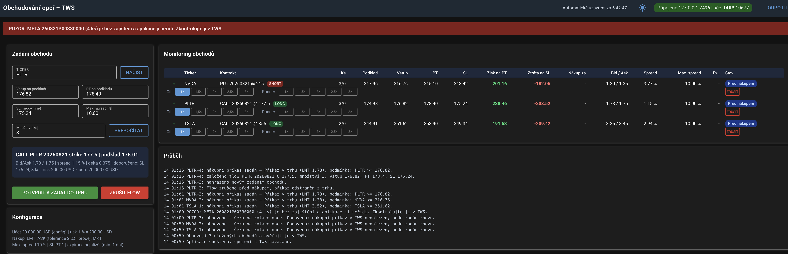

# Obchodování opcí přes TWS API

Formulářová aplikace pro obchodování opcí přes Interactive Brokers TWS API.
Zadaný obchod čeká na dosažení cenové úrovně podkladu, nakoupí opci
a po nákupu zajistí pozici prodejním příkazem pro PT i SL; část pozice může
běžet jako runner s vlastním, vzdálenějším cílem.

Běží na Windows, macOS i Linuxu — Python + `ib_async` + webové rozhraní NiceGUI.



## Spuštění

Nejjednodušší cesta — skript sám najde interpret, při prvním spuštění založí
virtuální prostředí, doinstaluje závislosti a aplikaci spustí:

```bash
# macOS a Linux
./run.sh
```

```bat
REM Windows
run.bat
```

Přepínače se skriptu předávají beze změny, například `./run.sh --no-connect`.

Rozhraní pak běží na <http://127.0.0.1:8080>.

### Ruční instalace a spuštění

Interpret se na jednotlivých systémech jmenuje různě — na macOS je to zpravidla
jen `python3`, na Windows `python`, na Linuxu podle distribuce jedno či druhé.

```bash
# macOS
python3 -m venv .venv
source .venv/bin/activate
pip install -r requirements.txt
python main.py
```

```bash
# Linux
python3 -m venv .venv          # na některých distribucích: python -m venv .venv
source .venv/bin/activate
pip install -r requirements.txt
python main.py
```

```bat
REM Windows
python -m venv .venv
.venv\Scripts\activate
pip install -r requirements.txt
python main.py
```

Po aktivaci prostředí příkazem `activate` funguje `python` na všech systémech.
Bez aktivace lze aplikaci spustit přímo: `.venv/bin/python main.py`
(na Windows `.venv\Scripts\python.exe main.py`).

Vyžadován je Python 3.10 nebo novější.

### Přepínače

| Přepínač | Význam |
| --- | --- |
| `-c CESTA`, `--config CESTA` | jiný konfigurační soubor (výchozí `config.yaml`) |
| `--no-connect` | nepřipojovat se k TWS při startu, spojení se naváže tlačítkem |
| `--verbose` | podrobné logování včetně komunikace `ib_async` |

### Nastavení TWS

V TWS (nebo IB Gateway) je nutné povolit API:
*Global Configuration → API → Settings → Enable ActiveX and Socket Clients*.
Číslo v poli **Socket port** musí souhlasit s `connection.port` v `config.yaml`.

Při prvním spuštění vznikne `config.yaml` jako kopie komentované šablony
`config.example.yaml`, kde je popsána každá volba.

## Jak aplikace pracuje

1. **Zadání** — vyplní se ticker, cena podkladu pro nákup a PT nebo SL
   (druhá úroveň se dopočítá). Aplikace načte cenu podkladu a sama určí zbytek:
   - **PUT/CALL** podle toho, zda vstupní cena leží nad nebo pod aktuální cenou
     (vstup nad trhem = průraz nahoru = CALL, vstup pod trhem = PUT),
   - **strike** jako nejbližší dostupný k ceně PT,
   - **expiraci** podle konfigurace (výchozí je nejbližší),
   - **SL**, pokud nebyl zadán, v poměru k PT z konfigurace (výchozí 1:1),
   - **množství** z velikosti účtu, povoleného rizika a delty opce:
     `riskovaná částka / (|vstup − SL| × |delta| × 100)`. Riskovaná částka
     vychází z velikosti účtu — buď z pevné hodnoty v konfiguraci, nebo
     ze skutečného stavu účtu, je-li `account.size: 0`.

   Určený směr ukazuje odznak **LONG (CALL)** / **SHORT (PUT)** vedle
   nadpisu *Zadání obchodu*. Je to jen indikace — objeví se hned po zadání
   tickeru a vstupní ceny (po opuštění pole se načte aktuální cena podkladu
   a směr se určí z polohy vstupu vůči ní), při dalších úpravách vstupu se
   průběžně přepočítává, při načtení běžícího obchodu přebírá jeho směr
   a při přechodu na jiný ticker zmizí. Bez spojení s TWS, kdy cena podkladu
   známá není, se směr napoví aspoň z polohy PT nebo SL na podkladu vůči
   vstupu.

   **PT a SL na podkladu, nebo na opci.** Pod polem *Množství* stojí
   oddělené bloky voleb *SL na podkladu / SL na opci* a *PT na podkladu /
   PT na opci* (výchozí stav určuje `trading.pt_on_underlying`
   a `trading.sl_on_underlying`). Volba *na podkladu* znamená cenu podkladu
   a hlídá
   ji podmíněný příkaz, jak je popsáno výše. Volba *na opci* je **zisk
   (PT), resp. ztráta (SL) v USD na jeden kontrakt** — 10 znamená posun
   ceny opce o 0,10 (nákup 3,00 → PT limit 3,10, SL stop 2,90). PT na opci
   se po nákupu realizuje limitním příkazem přímo na cenu opce, SL na opci
   stop-market příkazem. Oba režimy lze libovolně kombinovat.
   **PT a SL v procentech prémie.** Třetí volba v obou blocích — *PT na opci
   (% prémie)*, resp. *SL na opci (% prémie)* — zapisuje tutéž úroveň na opci
   podílem ze zaplacené prémie místo částky v USD. Prémie kontraktu je cena
   opce krát 100, takže **jedno procento prémie je právě cena opce v USD**:
   30 % z opce za 3,00 (300 USD) je 90 USD na kontrakt, z opce za 0,50 jen
   15 USD. Napříč různě drahými kontrakty tak každý obchod riskuje stejný díl
   vložených peněz, což pevná částka v USD nedělá — u levné opce bývá neúměrně
   velká (a naráží na strop prémie), u drahé zanedbatelná.

   Je to **jen jednotka formuláře**: procento se před odesláním přepočte na USD
   na kontrakt a obchod, engine i uložený stav dál pracují s USD úplně stejně
   jako u zápisu *na opci [USD/ks]*. Základem přepočtu je **odhadovaná nákupní
   cena** opce, tedy cena v okamžiku, kdy podklad dosáhne vstupní úrovně;
   náhled ji uvádí jako `základ procent: prémie ≈ 317 USD/ks`. Celý přepočet
   drží jednu jedinou prémii — do USD i zpět do procent — takže si PT a SL
   navzájem odpovídají, i když příprava nakonec vybere jinak drahý strike. Protože aplikace vybírá kontrakt
   teprve podle zadaných úrovní, sáhne si v tomto režimu do TWS dvakrát —
   poprvé jen pro odhad ceny opce, podruhé už se skutečnými úrovněmi; jakmile
   odhad pro daný ticker má, další načtení jsou jednoprůchodová. Dopočítávaná
   úroveň se do pole vrací také v procentech. Kompenzace **SL o zaplacený
   spread dál** je dostupná i zde — připočte se k přepočtené částce v USD.

   Odeslání bez načtených dat z TWS přepočet provést nemůže a formulář na to
   upozorní; stačí kliknout na *Načíst*. Načtený běžící obchod se do formuláře
   vrací v USD, protože procento zná jen formulář — po nákupu je prémie známá
   a pevná, takže USD je přesnější zápis.

   Při PT na opci se strike vybírá k úrovni podkladu, kterou aplikace
   odvodí z ceny opce: z aktuální kotace opce se strikem u vstupu zjistí
   implikovanou volatilitu, spočítá cenu opce v okamžiku vstupu, přičte
   požadovaný zisk a najde úroveň podkladu, kde opce této ceny dosáhne —
   strike tedy i tady leží na cílové úrovni. Cena opce pro model se bere
   ze středu BID/ASK, bez kotací z poslední (last) a nakonec ze závěrečné
   (close) ceny — TWS obvykle pošle závěrečnou cenu dřív než kotace, proto
   se po ní ještě `engine.quotes_grace_sec` počká na BID/ASK. Teprve bez
   jakékoliv ceny se použije lineární odhad přes deltu, bez delty vstupní
   cena. Zvolená úroveň i zdroj odhadu („z ceny opce (BID/ASK)“, „… (close)“,
   „z delty“) jsou vidět v náhledu formuláře. Počítá-li model ze závěrečné
   ceny, náhled i log na to výslovně upozorní: mimo obchodní hodiny je
   závěrečná cena jediná dostupná, a pohnul-li se mezitím podklad (typicky
   pre-market gap), vyjde z ní nesmyslná volatilita a s ní i dopočítané
   úrovně a množství.
   SL se bez zadání dopočítá stejným poměrem jako dosud (na opci
   `PT × poměr`); při smíšeném režimu se zisk na PT převede mezi podkladem
   a cenou opce stejným modelem, jakým se počítá sloupec *Zisk na PT*.
   Množství při SL na opci vychází přímo ze zadané ztráty:
   `riskovaná částka / SL v USD`. Ztráta se přitom stropí zaplacenou prémií —
   stop nemůže klesnout pod jeden tik, takže i SL zadaný nad prémii odnese
   nejvýš `(nákupní cena − tik) × 100` USD. Stejným stropem prochází
   i sloupec *Ztráta na SL*. Takový stop ale pozici prakticky nechrání —
   spustí se až u téměř bezcenné opce — proto na SL převyšující prémii
   upozorní náhled formuláře (z odhadované ceny opce při vstupu) a po nákupu
   znovu průběh (ze skutečné nákupní ceny), včetně skutečného stropu ztráty. Přepnutí režimu pole vyprázdní,
   protože hodnota by v novém režimu znamenala něco jiného.

   **SL o zaplacený spread dál.** Zaškrtávátko odsazené pod volbou režimu
   SL (výchozí stav `trading.sl_spread_compensated`), dostupné jen
   při SL zadaném na opci. Řeší to, že opce se kupuje u ASKu, ale stop
   se spouští BIDem: pozice je hned po nákupu v mínusu o celý spread,
   takže SL je ve skutečnosti blíž, než odpovídá zadané ztrátě. Při
   kotaci 3,85 / 3,95 a nákupu za 3,95 stojí SL 30 na 3,65 — stačí pokles
   BIDu o 0,20, ne o 0,30. Se zaškrtnutým přepínačem se k SL při nákupu
   připočte **skutečně zaplacený spread** (nákupní cena minus BID), takže
   zadaná hodnota odpovídá potřebnému pohybu ceny opce: stop klesne
   na 3,55. Ztráta na kontrakt o tentýž spread naroste (30 → 40 USD),
   proto s ní počítá i doporučené množství — náhled používá spread
   z aktuální kotace a uvádí jej jako `+ spread ≈ 10,00 USD`, skutečnou
   hodnotu určí až nákup a zapíše ji do průběhu. Než k němu dojde, ukazují
   sloupce *SL* a *Ztráta na SL* v přehledu odhad **včetně** spreadu
   z aktuální kotace (`≈ -20,00 USD`, resp. odpovídající ztráta), aby se
   hodnota po nákupu neměnila skokem; jakmile je spread znám, značka
   přibližné rovnosti zmizí. Připočtený spread nese
   obchod v poli `sl_spread_usd`, takže *Načíst* vrátí do formuláře
   původně zadanou hodnotu a kompenzace se při dalším zadání neřetězí.
   Break even se nekompenzuje — jeho stop má stát na zaplacené ceně;
   tlačítko *Počáteční SL* se naopak vrací na úroveň včetně spreadu.
   Bez známého BIDu (chybí kotace) se kompenzace neuplatní a průběh
   to zaznamená. PT se nekompenzuje: dráha k němu je o spread naopak
   delší, protože limitní prodej se vyplní, až na jeho cenu dosáhne BID.

   **Která úroveň je prvotní.** Oranžová dvojice voleb *Zadává se SL, PT se
   dopočítá podle poměru SL:PT* / *Zadává se PT, SL se dopočítá podle
   poměru SL:PT* v prvním bloku pod polem *Množství* (výchozí stav
   `trading.primary_level`, standardně `sl`)
   určuje, která z úrovní se zadává a která se dopočítává podle poměru
   `sl_to_pt_ratio`. Zadávaná úroveň stojí vždy vedle vstupu, dopočítávaná
   v dalším řádku – přepnutím si pole PT a SL vymění místo. Prvotní SL =
   povinný je SL a PT se dopočte (na podkladu zrcadlově
   `vstup ± |SL − vstup| / poměr`, na opci `SL / poměr`, ve smíšeném režimu
   přes cenu opce jako výše), prvotní PT = povinný je PT a dopočte se SL.
   Bez vstupní ceny dopočet neproběhne – úrovně se zrcadlí kolem vstupu.
   Poměr se bere z pole **RRR (PT:SL)** pod přepínači režimů. Zadává se jako
   poměr zisku ku riziku — *RRR 2* znamená, že PT je dvakrát dál než SL —
   tedy obráceně než konfigurační `sl_to_pt_ratio`, ze kterého vychází
   výchozí hodnota pole (`RRR = 1 / sl_to_pt_ratio`). Prázdné či nekladné
   pole se vrací ke konfiguraci.
   Dopočítanou úroveň lze vždy přepsat ručně; **Přepočítat** ji spočítá
   znovu — je-li ale prvotní pole prázdné, počítá se naopak z toho vyplněného,
   aby zadání nezmizelo celé. K odeslání proto stačí vstupní cena a kterákoliv
   z úrovní. Strike se i při dopočteném PT vybírá k jeho úrovni.

   TWS model greeks u opcí neposílá spolehlivě — závisí to na účtu
   a předplatném dat. Chybí-li delta, aplikace ji dopočítá z tržní ceny opce
   (implikovaná volatilita a z ní delta podle Black-Scholes) a ve formuláři
   ji označí jako dopočítanou. Teprve když nelze ani to, sáhne po náhradní
   hodnotě z konfigurace.
   Formulář má k tomu dvě tlačítka:
   **Načíst** obnoví údaje z TWS (cena podkladu, typ opce, expirace, strike,
   kotace, delta) a vyplněná pole nechá být — doplní jen ta prázdná.
   **Přepočítat** navíc přepíše dopočítávanou úroveň (SL, nebo PT podle
   volby prvotní úrovně) i množství vypočtenými hodnotami; zadaná
   hodnota se přitom zahodí a spočítá znovu podle poměru z konfigurace.
   Ručně zadané hodnoty tedy zmizí pouze na výslovné kliknutí, ne samovolně
   při psaní.
   V náhledu je vždy vidět, co by výpočet doporučil. Dokud načítání dat
   z TWS běží, ukazuje formulář pulzující text „Načítám data z TWS…".

   Běží-li na zadaném tickeru obchod, **Načíst** naplní formulář jeho
   parametry — i přes ručně zadané hodnoty. Přechod na ticker bez obchodu
   pole naopak vyprázdní, aby se do nového zadání nepřenesly ceny toho
   předchozího; limit spreadu se vrátí na hodnotu z konfigurace. Samotné
   opuštění pole hodnoty nikdy nepřepisuje, mění je jen změna tickeru.

2. **Nákup** — příkaz se do trhu zadá jen tehdy, pokud cena podkladu vstupní
   úroveň ještě nepřekonala: u CALL musí být pod vstupem, u PUT nad ním.
   Jinak obchod ujel a aplikace jej ukončí ve stavu *Vstup propásnut*, aniž by
   cokoliv zadala — platí to i pro opětovné zadání po zablokování spreadem.

   Do TWS se zadá příkaz na opci s cenovou podmínkou na podkladu.
   Dokud se nevyplní, aplikace průběžně upravuje jeho limitní cenu podle
   aktuálního ASK (resp. MID) a hlídá spread.
3. **Spread** — překročí-li nastavené procento, nevyplněný příkaz se odstraní
   z trhu; jakmile se spread vrátí do limitu, příkaz se zadá znovu. Aby se
   příkaz při kolísání kolem limitu nezadával a nerušil stále dokola, musí
   spread klesnout s rezervou pod limit a od odstranění musí uplynout
   nastavená prodleva (`rearm_spread_margin_pct`, `rearm_delay_sec`).
4. **Zajištění** — po nákupu se zadá prodejní příkaz se dvěma cenovými
   podmínkami na podklad spojenými logickým OR: dosažení PT nebo SL.
   S aktivním runnerem vzniknou příkazy dva — hlavní část a runner, každý
   s vlastním cílem a společným SL.
   Vyplnil-li se nákup jen částečně, aplikace nejprve zruší jeho nevyplněný
   zbytek a zajistí skutečně nakoupené množství — TWS totiž nepovolí mít
   na jednom opčním kontraktu současně nákupní i prodejní příkaz.

   Je-li PT nebo SL zadané na opci, nahradí jediný podmíněný příkaz
   **dvojice příkazů**:

   | PT | SL | Příkazy po nákupu |
   | --- | --- | --- |
   | podklad | podklad | jeden MKT (příp. LMT) s podmínkami PT OR SL — beze změny |
   | podklad | opce | MKT s podmínkou PT + stop-market na cenu opce |
   | opce | podklad | limit na cenu opce + MKT s podmínkou SL |
   | opce | opce | limit na cenu opce + stop-market na cenu opce |

   Dvojice je v TWS svázaná OCA skupinou (po vyplnění jednoho příkazu TWS
   druhý úměrně zmenší, resp. zruší — funguje to i ve chvíli, kdy aplikace
   neběží) a navíc ji hlídá aplikace sama: jakmile se jeden příkaz vyplní,
   druhý ihned ruší, aby se opce neprodala dvakrát. Prodá-li se část kusů
   na PT a zbytek po zmenšení na SL, je prodejní cenou vážený průměr obou
   a důvod výstupu „PT+SL“. **Částečné vyplnění** se do přehledu i do modelu
   pozice promítá hned, jak k němu dojde, ne až po dokončení prodeje: prodané
   kusy zmizí z otevřeného množství a další úpravy (sloučení runneru zpět,
   dorovnání po doplněném nákupu, uzavření trhem) se týkají jen zbytku.
   Množství se každému příkazu nastavuje jako „kolik ještě prodat“ zvýšené
   o jeho vlastní vyplnění — TWS totiž bere `totalQuantity` včetně už
   prodaných kusů. Vyplní-li se příkaz na menší množství, než pozice drží,
   skončí obchod ve stavu *Chyba* s údajem, kolik kusů zůstalo bez zajištění. Nepošle-li TWS nákupní cenu opce (tržní nákup
   bez limitu), vezme se jako základ pro úrovně na opci aktuální cena opce
   a aplikace na to upozorní v průběhu. Runner má vlastní
   dvojici ve vlastní OCA skupině. Zmizí-li z dvojice jeden příkaz bez
   vyplnění (například ručním zrušením v TWS), aplikace na to upozorní
   v průběhu, ale nenahrazuje jej naslepo — TWS ruší druhý příkaz i ve
   chvíli, kdy se první teprve vyplňuje, a nový příkaz by opci prodal
   podruhé. Zmizí-li oba, obchod skončí ve stavu *Chyba* jako dosud.
   Nastavení `trading.exit_order_type` se týká jen společného podmíněného
   příkazu; podmíněný příkaz v dvojici je vždy MKT.
5. **Monitoring** — tabulka ukazuje všechny obchody, jejich ceny a stav.
   Sloupec *Ks* ukazuje zadané množství a za lomítkem počet kontraktů právě
   otevřených v trhu: před nákupem `4/0`, po částečném vyplnění tří ze čtyř
   `4/3`, po prodeji runneru `4/2` a po uzavření celé pozice opět `4/0`.
   Pod každým rozpracovaným obchodem je řada tlačítek **1× 1,5× 2× 2,5× 3×**;
   posunou cíl na násobek jeho původní vzdálenosti od
   vstupu — u vstupu 232 a cíle 235 (tedy 3 body) znamená 2× cíl 238. Počítá
   se vždy z původního zadání, takže opakované klikání násobky neřetězí,
   a tlačítko odpovídající aktuálnímu cíli je barevně zvýrazněné. U nakoupené
   pozice se rovnou upraví podmínka zajišťovacího příkazu; u obchodu před
   nákupem záleží na `trading.pt_change_strike` — buď zůstane původní strike,
   nebo se podle nového cíle vybere jiný a příkaz se přezadá. Ve formuláři se
   zadává vždy základní cíl 1:1.

   U nakoupené pozice jsou před tlačítky cíle ještě tlačítka **Počáteční SL**
   a **SL BE** — první vrací stop na hodnotu ze zadání, druhé jej posouvá
   na vstupní cenu (break even). Aktivní volba je zvýrazněná stejně jako
   násobek cíle. Před nákupem se tlačítka nenabízejí — SL tam řídí zadání
   ve formuláři. Je-li cena podkladu ve chvíli přepnutí už na zvolené úrovni
   SL, nebo za ní, nemá smysl čekat na podmínku: aplikace podmíněný příkaz
   rovnou zruší a příslušnou část pozice prodá trhem.
   U úrovní zadaných na opci fungují tlačítka obdobně: násobky cíle násobí
   zisk v USD (2× z 10 USD je 20 USD, limit se posune na 3,20), *SL BE* je
   stop na nákupní ceně opce (ztráta 0 USD) a proražení se měří BIDem opce
   proti stop ceně příkazu (tedy po zaokrouhlení na tik). Nulová ztráta se
   do pole SL ve formuláři nepřenáší — tam by znamenala „nezadáno“ a nešlo
   by s ní přepočítat ani založit obchod; skutečnou úroveň ukazuje přehled.
   Ve sloupcích *PT* a *SL* se taková úroveň ukazuje jako částka v USD
   a po nákupu i s cenou opce, na kterou příkaz míří, např. `3,10 (+10,00 USD)`.

   U obchodů, které drží více kontraktů, než kolik jich zabírá runner
   (`trading.runner_quantity`, výchozí 1), je vedle tlačítek cíle i sekce
   **Runner**. Runner je část pozice prodávaná samostatným příkazem
   s vlastním cílem — kliknutím na násobek se zapne (nebo se mu cíl změní),
   *Zrušit runner* ho vypne a prodej se sloučí zpět do jednoho příkazu.
   SL přebírá runner při zapnutí od zbytku pozice; vlastní dvojicí tlačítek
   **Počáteční SL** a **SL BE** se pak jeho stop přepíná nezávisle, takže
   hlavní část může stát na break even a runner dál na původním stopu.
   Když hlavní část dosáhne PT (nebo ji prodáte tlačítkem), obchod zůstává
   otevřený, dokud runner nedoběhne; cíl běžícího runneru jde posouvat
   i poté. Runner jde zapnout před nákupem i za běhu a přežije restart
   aplikace.

   Prodaný runner se zúčtuje do realizovaného výsledku obchodu a jeho
   místo se uvolní — sekce Runner se znovu objeví a ze zbývající hlavní
   části lze oddělit **další runner**, dokud pozice drží víc kontraktů,
   než runner zabírá. Výsledek uzavřeného obchodu sčítá hlavní část se
   všemi prodanými runnery (v závěrečné zprávě jako „runnery N ks ±X USD").
   Sloupce *P/L*, *Zisk na PT* a *Ztráta na SL* naproti tomu ukazují vždy
   jen **dosud otevřený zbytek pozice** — realizovaný výsledek prodaných
   částí do nich nevstupuje a po uzavření obchodu zůstává pomlčka.
   P/L oceňuje otevřené kusy BIDem: prodává se tržním příkazem, takže BID
   odpovídá ceně, za kterou lze pozici právě teď skutečně prodat.

   U nakoupené pozice je na konci sekce Cíl tlačítko **Uzavřít pozici** —
   zruší zajišťovací příkaz a prodá hlavní část trhem (bez runneru celou
   pozici); případný runner běží dál se svým cílem. Obdobně **Uzavřít
   runner** na konci sekce Runner prodá trhem jen runner a hlavní část
   nechá být. Tržní prodej se v obou případech zadává až po potvrzení
   zrušení podmíněného příkazu, aby se neprodalo víc kusů, než pozice
   drží. Prodej všeho najednou zůstává v dialogu tlačítka *Zrušit*.

   Tlačítka se zobrazují jen tehdy, když má jejich akce smysl, a mizí
   s částí pozice, které se týkají: po prodeji hlavní části zmizí sekce
   Cíl (její cíl už není co řídit — spolu s ní zmizí i *Zrušit runner*,
   protože sloučení už není kam provést), po prodeji runneru jeho sekce,
   a během uzavírání trhem obojí, aby do rozjetého prodeje nešlo zasahovat.
   Stejná pravidla vynucuje i aplikace sama, takže se změna cíle nemůže
   omylem zapsat do tržního příkazu.

   Sloupce *Zisk na PT* a *Ztráta na SL* říkají, jak otevřená část pozice
   dopadne, když podklad dosáhne cílové, resp. stop úrovně (runner se
   oceňuje na svém vlastním cíli a SL). Prodejní ceny počítají s vyplněním
   u BIDu — od modelového středu trhu se odečítá půl aktuálního spreadu,
   stejně jako se u nákupu půl spreadu přičítá. Opce se přecení z implikované
   volatility odvozené z její aktuální ceny. Po nákupu se počítá ze skutečně
   dosažené ceny, před nákupem z ceny, na kterou opce vyjde **až podklad
   dosáhne vstupní úrovně** — tam se totiž bude kupovat. Úroveň zadaná
   na opci žádný model nepotřebuje: zisk, resp. ztráta je rovnou zadaná
   částka krát počet otevřených kontraktů.
   Hodnoty se přepočítávají s pohybem trhu. Předpokládá se, že podklad
   úrovně dosáhne brzy a volatilita zůstane stejná — při pozdějším pohybu
   bude výsledek nižší o časový rozpad.
   Tepající zelený puntík v prvním sloupci znamená, že obchod je pod dohledem
   aplikace. Objeví se jen u rozpracovaných obchodů a jen tehdy, když hlídání
   skutečně běží — vyžaduje spuštěnou monitorovací smyčku, navázané spojení
   s TWS a čerstvý průchod. Zhasne tedy i v případě, že se smyčka zasekne.
   Každý řádek má ve sloupci *Stav*, pod odznakem stavu, akci celého
   obchodu: běžící obchod tlačítko **Zrušit** (drží-li pozici, aplikace se
   nejprve zeptá, co s ní), ukončený obchod **Odstranit z přehledu**.
   Vpravo v nadpisu přehledu stojí tlačítko **Zrušit a smazat vše**. Po
   potvrzení zruší všechny běžící obchody i jejich příkazy v TWS a přehled
   vyprázdní. Držené pozice se přitom trhem neuzavírají — zajišťovací příkazy
   pro PT a SL zmizí a pozice zůstanou v TWS otevřené bez zajištění, na což
   potvrzovací dialog výslovně upozorní. Uzavřete je proto ručně, nebo místo
   hromadné akce použijte **Zrušit** v řádku, kde lze uzavření trhem zvolit.

Aplikace zvládá více obchodů současně; na jednom tickeru může běžet
zároveň jeden long (CALL) a jeden short (PUT) obchod. Směr zadání určuje
poloha PT vůči vstupu a nové zadání nahrazuje jen čekající obchod
stejného směru.

### Mimo obchodní hodiny

Před otevřením amerického trhu (15:30–22:00 SEČ / SELČ) TWS u opcí neposílá
BID ani ASK. Bez nich nelze určit limitní cenu, proto obchod zůstane ve stavu
**Čeká na kotace opce** a příkaz se do trhu zadá automaticky, jakmile kotace
dorazí. Aplikace v takové situaci záměrně nezadává tržní příkaz, který by se
vyplnil za neznámou cenu. Při nastavení `entry_order_type: MKT` se příkaz
zadá i bez kotací.

### Automatické uzavření před koncem obchodování

Patnáct minut před zavřením burzy (volitelné přes
`trading.auto_close_minutes_before`) aplikace sama ukončí všechny běžící
obchody: čekající obchody zruší a odstraní jejich nákupní příkazy z trhu,
otevřené pozice prodá tržním příkazem. Do hlavičky stránky se přes den
promítá odpočet do začátku uzavírání.

Čas se počítá v časové zóně burzy (`trading.exchange_timezone`, výchozí
`America/New_York`), takže posuny letního a zimního času vůči místnímu času
počítače nehrají roli. Čas zavření burzy určuje `trading.exchange_close_time`
(výchozí 16:00 newyorského času); zkrácené obchodní dny před svátky aplikace
nezná. Funkci lze vypnout pomocí `trading.auto_close_enabled: false`.

### Odpočet do otevření trhu

Mimo obchodní hodiny ukazuje hlavička odpočet do nejbližšího otevření burzy.
Čas otevření určuje `trading.exchange_open_time` (výchozí 09:30 newyorského
času) a počítá se ve stejné časové zóně jako uzavírání. Po zavření a o víkendu
odpočet míří na otevření následujícího obchodního dne, proto se u delších pauz
vypisuje i počet dní; svátky aplikace nezná. Během seance je odpočet skrytý
a nastavení nijak neovlivňuje obchodování.

### Stavy obchodu

| Stav | Význam |
| --- | --- |
| Před nákupem | příkaz je v trhu a čeká na cenovou podmínku |
| Blokováno spreadem | spread je nad limitem, příkaz není v trhu |
| Čeká na kotace opce | z TWS nedorazily BID/ASK, limitní příkaz zatím nelze zadat |
| Nakoupeno | opce koupena, zadává se prodejní příkaz |
| Nakoupeno – výstup aktivní | pozice je zajištěna příkazem pro PT i SL |
| Uzavírá se | pozice se na pokyn obchodníka uzavírá tržním příkazem |
| Uzavřeno | pozice uzavřena na PT nebo SL |
| Vstup propásnut | cena překonala vstupní úroveň, příkaz se nezadal |
| Zrušeno | obchod ukončen uživatelem |
| Chyba | zásah zvenčí, například ruční zrušení příkazu v TWS |

### Zrušení obchodu, který drží pozici

Zrušení obchodu vždy odstraní i zajišťovací příkaz pro PT a SL. Drží-li obchod
otevřenou pozici, aplikace se proto nejprve zeptá, co s ní:

* **Uzavřít pozici trhem a ukončit obchod** — zruší příkazy a pozici prodá
  příkazem MKT. Obchod projde stavem *Uzavírá se* a skončí jako *Uzavřeno*.
* **Ponechat pozici otevřenou** — zruší jen příkazy. Pozice zůstane v TWS
  **bez zajištění** a musíte ji ohlídat sami.
* **Nedělat nic** — zrušení se neprovede.

U obchodu, který ještě nenakoupil, se nic nedotazuje — zruší se rovnou.

### Pozice bez dozoru

Aplikace průběžně kontroluje opční pozice na účtu a na ty, ke kterým nemá
obchod ani zajišťovací příkaz, upozorní červeným pruhem v záhlaví a hláškou
v průběhu. Běží-li přitom obchod na stejném tickeru, upozornění výslovně uvede,
že se týká **jiného kontraktu** — jinak snadno vznikne dojem, že je pozice
pod dozorem, přestože obchod míří na jiný strike nebo expiraci. Sama k nim nic nezadává — nezná jejich PT ani SL. Interval kontroly
je `engine.unmanaged_check_sec` (výchozí 30 s, `0` kontrolu vypne).

## Přehled výsledků

Vedle nadpisu *Monitoring obchodů* stojí tlačítko **Výsledky**. Otevře popup
přes celou obrazovku s přehledem obchodního dne — co se obchodovalo, co ještě
běží a s jakým výsledkem. Monitorovací tabulka zůstává beze změny, přehled je
pouze pohled navíc; po zavření se nic neděje.

Přepínač **Dnes / Vše** v pravém horním rohu určuje rozsah. *Dnes* bere obchody
založené dnešního dne a k nim všechny, které stále běží (aplikace může běžet
přes noc nebo obnovit stav z předchozího dne). *Vše* ukazuje celý obsah
monitoringu bez ohledu na datum.

Obsah se obnovuje ze stejné smyčky jako tabulka, takže otevřené pozice v něm
tikají živě. Rozvržení je navržené na jednu obrazovku bez posuvníku — posouvají
se nejvýš samotné seznamy uvnitř svých panelů.

### Souhrnné dlaždice

| Dlaždice | Co ukazuje |
| --- | --- |
| Výsledek dne | realizovaný i otevřený výsledek dohromady |
| Realizováno | výsledek už prodaných kusů; zvlášť se uvádí část z obchodů, které dosud běží (prodaný runner) |
| Otevřené pozice | nerealizovaný výsledek otevřených pozic oceněný BIDem |
| Úspěšnost | podíl ziskových obchodů z ukončených, které skutečně nakoupily |
| Profit factor | poměr hrubého zisku k hrubé ztrátě, pod ním průměrný zisk a průměrná ztráta |
| Obchody | kolik jich běží, kolik skončilo a kolik se nedostalo k nákupu |

Statistiky úspěšnosti počítají **jen ukončené obchody s nákupem** — běžící
pozice se do nich nezapočítává, dokud se výsledek může ještě otočit, a
propásnutý či před vstupem zrušený obchod se nikdy neodehrál.

### Panely

* **Běží teď** — otevřené i čekající obchody s nákupní cenou, aktuálním BIDem
  a otevřeným P/L. Pruh *SL → PT* ukazuje, kde pozice stojí mezi stop-lossem
  (vlevo) a cílem (vpravo); vychází z otevřeného výsledku proti očekávanému
  zisku na PT a ztrátě na SL, takže funguje ve všech režimech zadání úrovní.
* **Uzavřené obchody** — od nejnovějšího, s dosaženými cenami, dobou držení
  a důvodem výstupu (PT, SL, ručně, propásnuto, zrušeno). Pruh *Porovnání*
  vynáší výsledek proti největšímu výsledku dne — ztráta doleva, zisk doprava.
* **Průběh dne** — kumulovaný realizovaný výsledek, bod za každý uzavřený obchod.
* **Výsledek podle tickeru** — součet realizovaného i otevřeného výsledku
  po tickerech, seřazený od nejlepšího po nejhorší.

## Načtení pozic ze souboru

Vedle nadpisu *Zadání obchodu* stojí tlačítko **Načíst ze souboru**. Otevře
popup formulář, ve kterém se vybere YAML soubor se zadáním obchodního dne
(například `2026-08-25.yaml`) a všechny pozice z něj se zadají naráz.

Ze souboru se čerpá **jen z položek, jejichž klíč končí plusem** (`AMZN Long+`),
a to pouze ze tří údajů — `symbol`, `entry_price` a `target_price`. Ostatní
pole souboru patří jinému nástroji a aplikace je ignoruje; položky bez plusu
se přeskočí. Vadná položka (chybějící ticker či cena, cíl shodný se vstupem)
načtení nezastaví — přeskočí se a důvod se vypíše nad tabulkou, aby zbytek
souboru zůstal použitelný.

Nad tabulkou se volí režim cíle, společný všem načteným pozicím:

- **PT na podkladu v % dráhy k cíli** — PT je cena
  podkladu, spočítaná jako `vstup + (target_price − vstup) × %/100`. Při 100 %
  je to přesně cílová cena ze souboru, při 50 % půlka cesty k ní; znaménko
  rozdílu řeší směr, takže vzorec platí pro long i short. SL se dopočítá
  rovněž **na podkladu** podle pole *RRR (PT:SL)*.
- **PT na opci v USD/ks** — PT je zisk na jedné opci v USD, společný
  všem pozicím, a SL je ztráta na opci podle téhož poměru. Cílová cena ze
  souboru se v tomto režimu nepoužívá.
- **PT na opci v % prémie** — totéž, ale zadané podílem ze zaplacené prémie.
  Prémie kontraktu je cena opce krát 100, takže jedno procento prémie je právě
  cena opce v USD: 30 % z opce za 3,00 (300 USD) je 90 USD na kontrakt, z opce
  za 0,50 jen 15 USD. Napříč košíkem tak každá pozice riskuje stejný **díl
  vložených peněz**, což pevná částka v USD nedělá — u levné opce bývá
  neúměrně velká (a naráží na strop prémie), u drahé zanedbatelná.

  Procento se vztahuje k **odhadované nákupní ceně** opce, tedy k ceně
  v okamžiku, kdy podklad dosáhne vstupní úrovně. Aplikace ji zjistí tak, že
  nejprve připraví zadání s cílem ze souboru na podkladu, z vybraného kontraktu
  vezme odhad ceny a teprve z něj spočítá PT v USD — proto sahá do TWS dvakrát
  a příprava je o něco pomalejší. Použitá prémie se ukáže ve sloupci *Stav*
  (`prémie ≈ 300 USD`). Do pole *PT* se zapíše výsledek v USD/ks, takže se dá
  ručně doladit; dál obchod běží jako běžné zadání na opci.

V obou opčních režimech (USD/ks i % prémie) má smysl zaškrtávátko
**SL o zaplacený spread dál** — chová se stejně jako v běžném formuláři.

**Runner** se nastavuje u každé pozice zvlášť — comboboxem ve stejnojmenném
sloupci tabulky (*Bez* / *1×* … *3×*). Sada tlačítek *Nepoužít runner* / *1×* …
*3×* nad tabulkou slouží jako **výchozí hodnota**: přepne volbu u všech dosud
nezadaných řádků naráz, takže stačí nastavit ji globálně a jednotlivé pozice
pak jen doladit. Výchozí stav je *Nepoužít runner*.

Zvolený násobek zapne u založeného obchodu runner (počet kusů podle
`trading.runner_quantity`) s cílem na tomto násobku původní vzdálenosti PT od
vstupu — přesně jako tlačítka runneru v řádku přehledu. Zapíná se až na hotovém
obchodu, takže před nákupem si obchod volbu jen zapamatuje a zajišťovací příkazy
se po nákupu založí rovnou rozdělené. Pozice s příliš malým množstvím runner
nedostane (vyžaduje víc kontraktů, než je jeho velikost); obchod se přesto
založí a důvod se objeví ve sloupci *Stav*.

Vedle režimu se zadává **Max. spread [%]** a **RRR (PT:SL)** pro dopočet SL —
*RRR 2* dá SL na polovině vzdálenosti PT. Obojí vychází z konfigurace. Tlačítkem
**Přepočítat** se PT, SL i množství u všech dosud nezadaných pozic spočítají
znovu; tlačítko ↻ v řádku přepočte jedinou pozici a **ponechá** v ní ručně
upravené PT. Množství se určuje stejně jako v běžném formuláři — z riskované
částky, delty opce a vzdálenosti ke SL, resp. přímo ze ztráty na kontrakt.

Tabulka ukazuje u každé pozice směr ze souboru, vstupní i cílovou cenu, vybraný
opční kontrakt a **editovatelná pole PT, SL a Ks**. Skutečný směr určuje
aplikace z aktuální ceny podkladu jako vždy; liší-li se od směru daného souborem,
trh už vstupní úroveň překonal — takový řádek se označí jako *Vstup propásnut*
a **odškrtne**, aby se omylem nezaložil obchod na opačnou stranu. Zaškrtnutím
jej lze přesto zadat.

Tlačítko **Zadat vybrané pozice do trhu** založí obchody postupně, každý stejným
způsobem jako ruční zadání formulářem — včetně všech kontrol. Chyba jedné pozice
ostatní nezastaví, zapíše se do jejího sloupce *Stav*. Bez spojení s TWS se pozice
načtou a PT vyplní (je to čistý výpočet ze zadání), SL ani množství se ale
dopočítat nedají.

### Opakované zadání téže pozice

Řádek si obchod, který z něj vznikl, pamatuje a jeho sloupec *Stav* pak ukazuje
**živý stav toho obchodu** (`Zadáno AMZN-5 – Před nákupem`). Zaškrtnutí se po
zadání sundá, aby druhý stisk tlačítka tentýž řádek neposlal do trhu podruhé —
zaškrtnout jej ale lze znovu a pozici tím **přepsat**. Platí přitom stejné
pravidlo jako ve formuláři zadání:

| Stav založeného obchodu | Řádek |
| --- | --- |
| Připravuje se, Před nákupem, Blokováno spreadem, Čeká na kotace | lze zadat znovu — engine původní obchod zruší, odstraní z přehledu a nahradí novým (nastavení runneru se přenese) |
| Nakoupeno, Nakoupeno – výstup aktivní, Uzavírá se | **zamčeno** — obchod drží pozici, nejprve jej zrušte v monitoringu |
| Uzavřeno, Zrušeno, Vstup propásnut, Chyba | lze zadat znovu — vznikne nový obchod, ten původní zůstává v přehledu |
| smazán z monitoringu | lze zadat znovu |

Zámek se přepočítává průběžně, dokud je dialog otevřený. Vyplní-li se nákup,
řádek se zamkne sám; smažete-li obchod z monitoringu, sám se odemkne — soubor
kvůli tomu není potřeba načítat znovu.

Každé otevření formuláře navíc **zaškrtne všechny řádky, které lze zadat**, takže
se dá celý soubor poslat do trhu znovu jedním tlačítkem. Obnoví se tím i zaškrtnutí
sundané dřívějším zadáním nebo propásnutým vstupem; zamčený řádek zůstává
odškrtnutý. U propásnutého vstupu zadání odmítne až engine a důvod zapíše
do sloupce *Stav* — obchod na opačnou stranu tedy nevznikne.

## Velikost účtu

Riskovaná částka se počítá z velikosti účtu, kterou lze zadat dvěma způsoby:

| `account.size` | Chování |
| --- | --- |
| kladná hodnota (např. `5000.0`) | použije se přesně tato částka |
| `0` | velikost se převezme z TWS (NetLiquidation) a průběžně obnovuje |

Při `0` odpovídá riziko skutečnému stavu účtu včetně otevřených pozic; hodnota
se načítá po připojení a dál se obnovuje v intervalu `engine.account_refresh_sec`
(výchozí 60 s). Dokud ji TWS nepošle, aplikace na to upozorní ve formuláři
a množství nedoporučí. V panelu *Konfigurace* je vždy vidět, odkud hodnota
pochází — `(config)`, nebo `(z TWS)`.

## Konfigurace

Vše podstatné je v `config.yaml` (podrobné komentáře u každé položky):
spojení s TWS, velikost účtu a risk, typ nákupního příkazu
(`LMT_ASK` / `MKT` / `LMT_MID`), typ prodejního příkazu, limit spreadu,
poměr SL:PT, výchozí režim PT a SL (na podkladu / na opci) a výběr expirace.

## Testy

```bash
python -m unittest discover -s . -p "test_*.py"
```

Testy běží proti náhradě TWS (`tests/fake_ib.py`) — pokrývají výpočty,
čtení tržních dat i celý průběh obchodu včetně příkazů, jejich podmínek,
runneru, režimů PT/SL na opci (`tests/test_rezimy.py`), načítání pozic ze
souboru (`tests/test_import.py`), souhrn obchodního dne
(`tests/test_report.py`) a obnovy po restartu. Spojení s TWS není
potřeba.

## Struktura

```
run.sh, run.bat          spuštění na macOS/Linuxu, resp. Windows
main.py                  spuštění aplikace
config.example.yaml      komentovaná šablona konfigurace
tws_opce/
  config.py              načtení a validace konfigurace
  calc.py                výpočty (typ opce, SL, spread, množství, limity)
  models.py              model obchodu a jeho stavy
  ib_service.py          obálka nad ib_async (kontrakty, data, příkazy)
  engine.py              řízení obchodů a monitorovací smyčka
  store.py               ukládání stavu obchodů na disk
  importer.py            načtení vstupních pozic ze souboru se zadáním dne
  import_dialog.py       popup formulář hromadného zadání načtených pozic
  report.py              souhrn obchodního dne pro přehled výsledků
  report_dialog.py       popup s přehledem výsledků na celou obrazovku
  ui.py                  webové rozhraní
  static/styles.css      styly
tests/                   testy
```

## Stav obchodů a restart

Stav obchodů se průběžně zapisuje do `state.json`, takže restart ani pád
aplikace o rozpracované obchody nepřipraví. Po startu se uložený stav **vždy
srovná se skutečností v TWS** — rozhoduje to, co je v TWS, nikoliv zápis
v souboru:

| Co aplikace po startu najde | Jak zareaguje |
| --- | --- |
| pozice a k ní prodejní příkaz | pokračuje v hlídání |
| pozice bez prodejního příkazu | zajištění doplní |
| prodaná hlavní část a běžící runner | nechá runner běžet, nic nezadává |
| rozdělané uzavírání trhem | dokončí je (tržní prodej dál hlídá) |
| pozice uzavřená během výpadku | označí obchod za uzavřený |
| nákupní příkaz čekající v trhu | naváže na něj |
| nákupní příkaz, který v TWS není | zadá jej znovu |
| nakoupený obchod bez pozice i příkazu | označí jako chybu k ruční kontrole |

Zajištění se posuzuje po částech pozice zvlášť: hlavní část, která už je
prodaná, ani část právě uzavíraná trhem žádné nepotřebují, takže se kvůli
nim nesahá na zdravé příkazy té druhé. Vyplněný příkaz se přitom za živý
nepovažuje — prodal, co měl, a v trhu po něm nic nezůstalo. Kolik kusů
se má zajistit, říká **pozice v TWS**, ne nákupní příkaz: po restartu
uprostřed rozprodávání bývá nižší.

Aby aplikace své příkazy poznala, značkuje je v poli `orderRef` zápisem
`TWSOPCE:<obchod>:entry`, `:exit`, resp. `:runner`; druhý příkaz dvojice
(SL na opci nebo na podkladu při odděleném výstupu) nese `:exitsl`,
resp. `:runnersl`. Cizích příkazů na účtu si nevšímá,
takže vedle ní můžete obchodovat i ručně.

Drží-li účet pozici a z dvojice prodejních příkazů přežil jen jeden,
aplikace jej zruší, počká na potvrzení a zajištění založí znovu celé.
Ztratí-li se soubor se stavem, převzatý obchod si nese i **nákupní cenu opce**
z vyplněného příkazu — bez ní by úrovně zadané na cenu opce nešlo spočítat
ani měnit. Přežije-li jen příkaz pro SL (`:exitsl`), pozná se z něj režim SL
i jeho hodnota; stop na nákupní ceně znamená break even.

Ztratí-li se soubor se stavem, aplikace podle těchto značek dohledá alespoň
**čekající příkazy** a obchody z nich sestaví — vstupní cenu z cenové podmínky
příkazu, PT a SL z podmínek zajišťovacího příkazu; u příkazů na cenu opce
odvodí zisk a ztrátu v USD z limitní, resp. stop ceny proti nákupní ceně.
Chybí-li zajišťovací příkaz, odvodí PT ze strike a SL z poměru v konfiguraci
a obchod označí za dopočítaný.

Co takto zachránit nelze, je **už nakoupená pozice bez zajišťovacího příkazu**:
vyplněné příkazy TWS vrací bez `orderRef`, takže je k obchodu přiřadit nejde.
Aplikace na každou opční pozici, ke které nemá obchod, upozorní hláškou
„POZOR" v průběhu a nechá ji na vás — sama k ní nic nezadává, protože nezná
původní PT ani SL.

Totéž proběhne po **každém obnovení spojení** — po ručním odpojení a připojení
tlačítkem i po výpadku sítě. Objekty příkazů z minulého spojení už nejsou platné,
takže se obchody pokaždé znovu spárují s tím, co je skutečně v TWS.

Podmínkou je, aby aplikace používala **stejné `client_id`** — jinak jí TWS
vlastní příkazy nevydá. Ukládání lze vypnout přes `state.enabled: false`.

## Upozornění

Aplikace zadává skutečné příkazy do trhu. Vyzkoušejte ji nejprve na papírovém
účtu (port 7497), případně s `connection.readonly: true`, kdy aplikace příkazy
nezadává.
